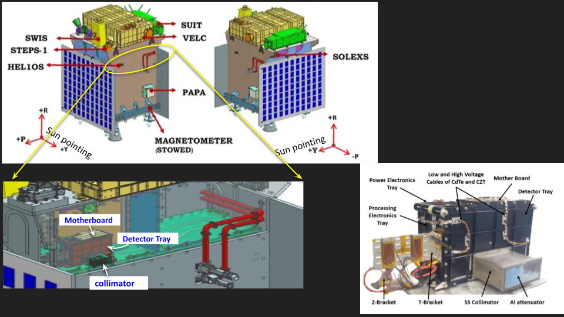
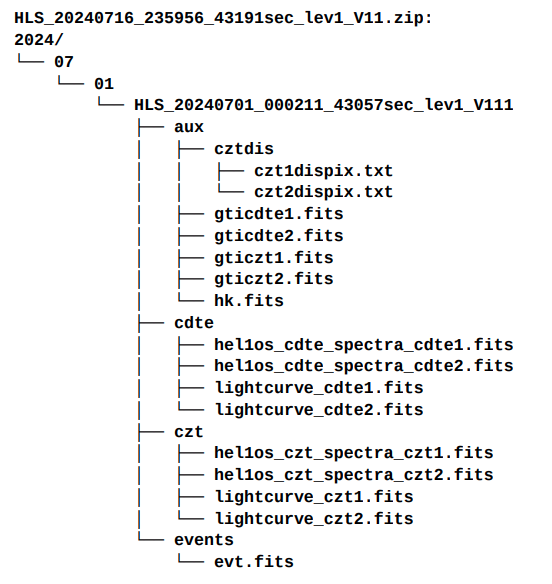
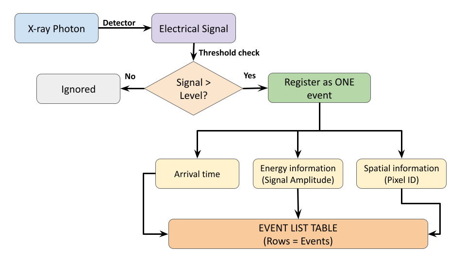
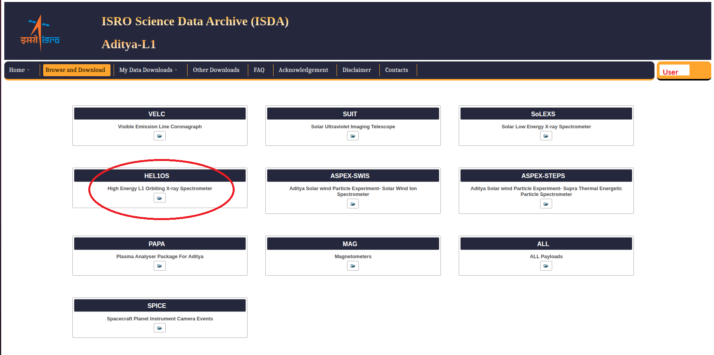
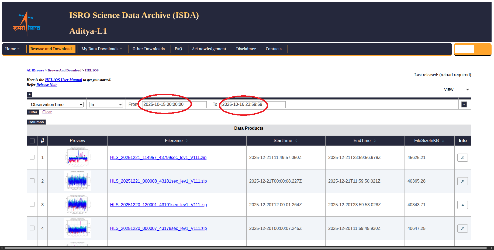
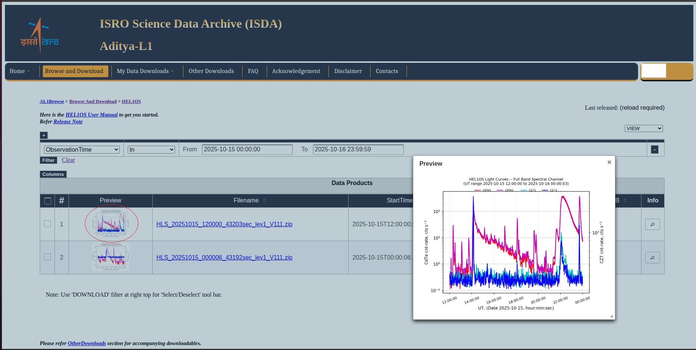
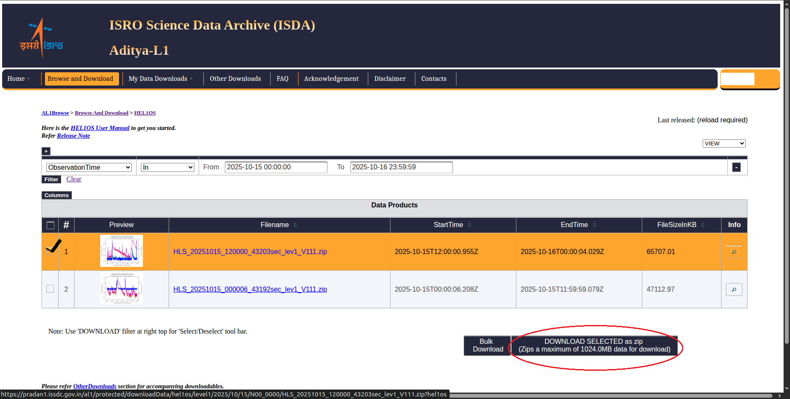

# Introduction to HEL1OS (High Energy L1 Orbiting X-ray Spectrometer) on Aditya-L1
## 1. Introduction
HEL1OS (High Energy L1 Orbiting X-ray Spectrometer) is one of the remote sensing payloads onboard the Aditya-L1 solar observatory of the Indian Space Research Organization (ISRO). The instrument is designed to continuously monitor the time-resolved hard X-ray spectra of solar flaes in the 8-150 keV energy range from Sun-Earth Lagrange point L1. Operating from L1 provides HEL1OS an uninterrupted view of the Sun, free from solar occultation and strong orbital background variations.  
## 2. Instrument Overview

The payload is mounted on the Sun-facing intermediate deck of the Aditya-L1 spacecraft, and is equipped with a stainless-steel collimator providing a field-of-view (FOV) of approximately 5.6° × 5.6°. This narrow FOV limits off-axis background while maintaining sufficient throughput for flare observations. 

HEL1OS employs two types of solid-state semiconductor detectors:
* Cadmium Telluride (CdTe) for the lower energy band (~8–70 keV), and
* Cadmium Zinc Telluride (CZT) for the higher energy band (~20–150 keV)

The combined geometric area of the two CdTe detectors is 0.5 cm², while the two pixelated CZT detectors provide a much larger total area of 32 cm², enabling high sensitivity to both moderate and intense solar flares. The instrument parameters are tabulated below:

| Parameter | Specifications |
| :--- | :--- |
| **Energy Range (keV)** | **Total coverage:** ~ 8 to 150 keV **Light curve/Time Profile Analysis:** • CdTe ≳ 8 keV • CZT ≳ 20 keV **Spectral Analysis:** • CdTe ≳ 9.5 keV • CZT ≳ 20 keV |
| **Energy Resolution (keV)** | ~1 keV @14 keV ~7 keV @60 keV |
| **Temporal Cadence** | **Event cadence:** 10 millsec **Light curve/Time Profile:** 1 seconds **Time resolved Spectroscopy:** 20 seconds |
| **Field of View (FOV)** | 5.6° x 5.6° |

The instrument consists of three major sub-assemblies: 
- Front-End Electronics (FE) Tray – hosts the CdTe and CZT detectors and low-noise pre-amplifiers,
- Processing Electronics (PE) Tray – handles digital pulse processing, packetization of event data, telecommand decoding, and telemetry generation,
- Power Conditioning Electronics (PCE) Tray – generates and regulates low- and high-voltage supplies for detector biasing and electronics.
Two independent Am-241 radioactive calibration sources are permanently integrated into the payload for continuous in-orbit gain and spectral calibration using the 59.5 keV gamma-ray line.

HEL1OS was switched ON in orbit in October 2023, and its operational parameters—including detector biases and energy thresholds—were stabilized by June 2024. The typical observational products include 1-second cadence light curves and 20-second cadence Type-II OGIP spectral files, which are made available to the scientific community through the ISSDC–PRADAN data portal.

If you need any more details on the HEL1OS instrument, refer **Nandi, A., Sudhakar, M., Tadepalli, S.P. et al. *HEL1OS – A Hard X-ray Spectrometer on Board Aditya-L1*. Sol Phys 300, 140 (2025)**, https://doi.org/10.1007/s11207-025-02543-8, https://arxiv.org/abs/2512.12679 

### 2.1 Why do we need two detectors?

### 2.2 Level-1 Data Structure

#### 2.2.1 **What is the Event List?** 
The Event list can be considered as a fundamental data product and is represented by a table consisting of rows or "events". 

We generate derived data products like light curves and spectral files from the event list. For more details, refer **Section 3 *A Short Introduction to X-ray Data Analysis*** in the **HEL1OS User Manual**, which can can be accessed after logging into your user account in https://pradan1.issdc.gov.in/al1/. 

## 3. Tools for processing and analyzing Level-1 Event Data 

## 4. Accessing HEL1OS Data

